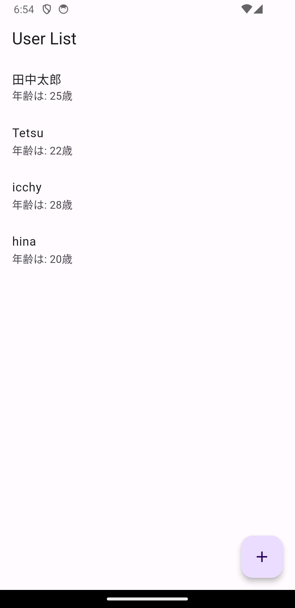
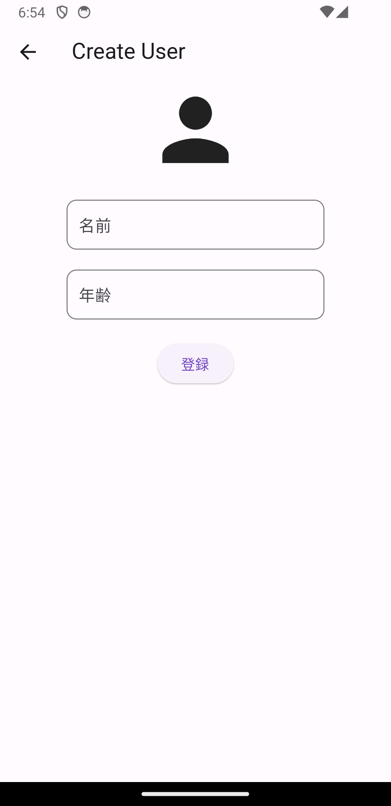
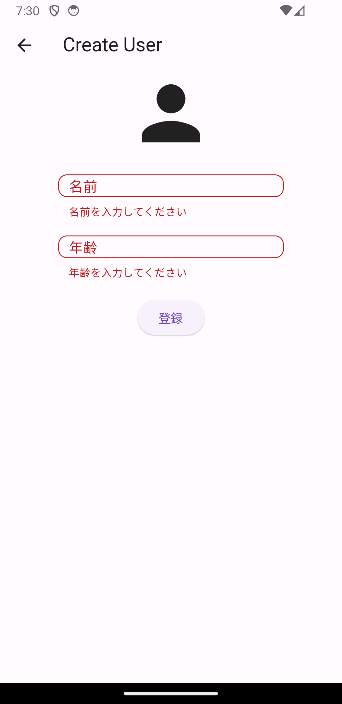

# MENTA用のサンプルコード

動作はこんな感じです

  


## モデルクラスを作成する
ユーザーのデータを管理するためのモデルクラスを作成します。作成と読み込みで使います。`required`をつけると、引数が必須になります。`UserState`クラスをインスタンス化した場合は、`name`と`age`の値を渡す必要があります。

```dart
import 'package:freezed_annotation/freezed_annotation.dart';
import 'package:flutter/foundation.dart';

part 'user_state.freezed.dart';

part 'user_state.g.dart';

/// [freezed]のファイルを生成するコマンド
/// [watch]をつけるとファイルを監視して変更があるたびに自動で生成してくれる
/// 停止するときは、[Ctrl + C]で停止する
// flutter pub run build_runner watch --delete-conflicting-outputs

@freezed
class UserState with _$UserState {
  const factory UserState({
    required String name,
    required int age,
  }) = _UserState;

  factory UserState.fromJson(Map<String, Object?> json)
      => _$UserStateFromJson(json);
}
```

## ロジックを作る
Firestoreを使うプロバイダーとFirestoreのデータを追加・表示するメソッドを持っているクラスを定義します。
```dart
import 'package:cloud_firestore/cloud_firestore.dart';
import 'package:hooks_example/user_example/model/user_state.dart';
import 'package:hooks_riverpod/hooks_riverpod.dart';

// Firestoreを使用するためのプロバイダー
final fireStoreProvider = Provider<FirebaseFirestore>((ref) => FirebaseFirestore.instance);

// ユーザー情報を取得するためのFutureProvider
final userStateFutureProvider = FutureProvider<List<UserState>>((ref) async {
  final userStateAPI = UserStateAPI(ref);
  return userStateAPI.fetchUsers();
});

final userStateAPIProvider = Provider<UserStateAPI>((ref) => UserStateAPI(ref));

/// [ref]はプロバイダーにアクセスするためのもの
/// この場合は、fireStoreProviderを参照するためのもの
/// メソッドの中で、[collection]を参照するために使用する
class UserStateAPI {
  UserStateAPI(this.ref);
  final Ref ref;// ここに、refつけないと、メソッドでfireStoreProviderを参照できない

  Future<void> createUser(UserState userState) async {
    await ref.read(fireStoreProvider).collection('users').add(userState.toJson());// .toJsonをつけるのは、Map型に変換するため
  }

  /// Firestoreから１度だけデータを取得するには[QuerySnapshot]を使用する
  /// 特定のドキュメントを監視するには[DocumentSnapshot]を使用する。.doc('id')を使用する
  Future<List<UserState>> fetchUsers() async {
    final snapshot = await ref.read(fireStoreProvider).collection('users').get();
    return snapshot.docs.map((doc) => UserState.fromJson(doc.data())).toList();
  }
}
```

## データを表示するUIと追加するUI
`UserView`のページでは、`userStateFutureProvider`を使用して、データを取得して表示します。
```dart
import 'package:flutter/material.dart';
import 'package:hooks_example/user_example/api/firebase_provider.dart';
import 'package:hooks_example/user_example/view/create_user_view.dart';
import 'package:hooks_riverpod/hooks_riverpod.dart';

/// Firestoreから取得したユーザー情報を１度だけ全て表示するUI
class UserView extends ConsumerWidget {
  const UserView({super.key});

  @override
  Widget build(BuildContext context, WidgetRef ref) {
    final users = ref.watch(userStateFutureProvider);
    return Scaffold(
      appBar: AppBar(
        title: const Text('User List'),
      ),
      floatingActionButton: FloatingActionButton(
        onPressed: () {
          Navigator.of(context).push(
            MaterialPageRoute(
              builder: (context) {
                return const CreateUserView();
              },
            ),
          );
        },
        child: const Icon(Icons.add),
      ),
      body: users.when(
        data: (userList) {
          return ListView.builder(
            itemCount: userList.length,
            itemBuilder: (context, index) {
              final user = userList[index];
              return ListTile(
                title: Text(user.name),
                subtitle: Text('年齢は: ${user.age}歳'),
              );
            },
          );
        },
        loading: () => const CircularProgressIndicator(),
        error: (error, stackTrace) {
          return Center(
            child: Text('Error: $error'),
          );
        },
      ),
    );
  }
}
```

floatingActionButtonを押すと、`CreateUserView`のページに遷移します。
こちらのページで、Firestoreにデータの追加と`ref.invalidate`を使用して、`FutureProvider`を強制的に更新してます。`Form`Widgetを使って、入力された値がnullの場合、validationが実行されます。

```dart
import 'package:flutter/material.dart';
import 'package:hooks_example/user_example/api/firebase_provider.dart';
import 'package:hooks_example/user_example/model/user_state.dart';
import 'package:hooks_riverpod/hooks_riverpod.dart';

// GlobalKeyを使用するためのProvider
final createUserViewKeyProvider = Provider((ref) => GlobalKey<FormState>());

class CreateUserView extends ConsumerWidget {
  const CreateUserView({super.key});

  @override
  Widget build(BuildContext context, WidgetRef ref) {
    // ref.readを使用して、createUserViewKeyProviderを参照する
    final key = ref.read(createUserViewKeyProvider);
    final nameController = TextEditingController();
    final ageController = TextEditingController();

    return Scaffold(
      appBar: AppBar(
        title: const Text('Create User'),
      ),
      body: SingleChildScrollView(
        child: Form(
            key: key, // GlobalKeyを使用するためのkey。これで、Formの状態を管理できる
            child: Center(
              child: Column(
                children: [
                  // 人間のiconを表示
                  const Icon(
                    Icons.person,
                    size: 100,
                  ),
                  const SizedBox(height: 20),

                  /// [TextFormField]の値がnullの場合、validationが実行される
                  SizedBox(
                    width: 259,
                    height: 50,
                    child: TextFormField(
                      controller: nameController,
                      decoration: const InputDecoration(
                        labelText: '名前',
                        border: OutlineInputBorder(
                          borderRadius: BorderRadius.all(Radius.circular(10)),
                        ),
                      ),
                      validator: (value) {
                        if (value!.isEmpty) {
                          return '名前を入力してください';
                        }
                        return null;
                      },
                    ),
                  ),
                  const SizedBox(height: 20),
                  SizedBox(
                    width: 259,
                    height: 50,
                    child: TextFormField(
                      controller: ageController,
                      decoration: const InputDecoration(
                        labelText: '年齢',
                        border: OutlineInputBorder(
                          borderRadius: BorderRadius.all(Radius.circular(10)),
                        ),
                      ),
                      keyboardType: TextInputType.number,
                      validator: (value) {
                        if (value!.isEmpty) {
                          return '年齢を入力してください';
                        }
                        return null;
                      },
                    ),
                  ),
                  const SizedBox(height: 20),
                  ElevatedButton(
                    onPressed: () async {
                      // ifで、Formの状態が正しいかを確認する。trueの場合、データを登録する。falseの場合、エラーメッセージを表示する!
                      if (key.currentState!.validate()) {
                        // freezedのクラスをインスタンス化して、Formの値を渡す
                        final userState = UserState(
                          name: nameController.text,
                          age: int.parse(ageController.text),
                        );
                        await ref
                            .read(userStateAPIProvider)
                            .createUser(userState);
                        // ここで、userStateFutureProviderをinvalidateすることで、再度データを取得する。
                        // 強制的に状態を更新することができる。Streamを使いたくない場合に使用してます。
                        ref.invalidate(userStateFutureProvider);
                      }
                    },
                    child: const Text('登録'),
                  ),
                ],
              ),
            )),
      ),
    );
  }
}
```
